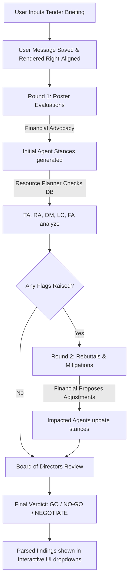

# TenderMind AI — Boardroom Deliberation Swarm

TenderMind AI is a multi-agent decision intelligence platform designed to evaluate complex corporate tenders. By simulating a structured boardroom negotiation between specialized AI personas, the platform transforms raw project input into an authoritative verdict (`GO`, `NO-GO`, or `NEGOTIATE`) supported by granular compliance, operational, resource, and financial findings.

---

## 1. Why Multiple Agents Are Required
* **Cognitive Load & Domain Expertise**: A single AI model attempting to evaluate a 10-page tender requirements document across technical feasibility, staffing, finance, legal, risk, and operations faces severe cognitive bias and hallucinations. Breaking this down into specialized agent personas ensures each focuses strictly on its core competency.
* **Simulated Corporate Governance**: The system mimics real boardroom dynamics. Conflict is intentional: the **Financial Analyst** drives the commercial "GO" case, while the **Risk Analyst**, **Legal Analyst**, and **Resource Planner** serve as guardrails. The interaction of these opposing interests yields highly balanced compromises.
* **Deterministic Sequencing**: Collaborative decision-making requires sequential auditing. An architect's concerns about technology complexity directly feed into the risk analyst's cost estimation, which in turn influences the financial analyst's margin calculations.

---

## 2. Roster: Skills & Responsibilities of Each Agent

| Agent | Responsibility | Core Skillset / Data Queries |
| :--- | :--- | :--- |
| **Technical Architect (TA)** | Technical feasibility and solution engineering. | Tech-stack compatibility analysis, development architecture alignment. |
| **Resource Planner (RP)** | Roster constraints and staffing capability analysis. | Database query execution (`employee_techstacks`, `employee_projects`) to check developer availability. |
| **Risk Analyst (RA)** | Risk category assignment (`LOW` $\rightarrow$ `CRITICAL`) and mitigation planning. | Operational exposure estimation, buffer sizing, vulnerability identification. |
| **Operations Manager (OM)** | Delivery timelines, execution methodology, and timeline reality checks. | Project lifecycle mapping, sprint planning, execution efficiency review. |
| **Legal & Compliance (LC)** | Regulatory validation (GDPR, HIPAA, PCI-DSS compliance). | Regulatory audit, penalty liability exposure, contract clause review. |
| **Financial Analyst (FA)** | Financial viability, margin verification, pricing accuracy. | Margin modeling, cost/rate computation, billing adjustments. |
| **Board of Directors** | Synthesis of findings and final authority to issue a verdict. | Group consensus parsing, trade-off resolution, executive recommendation writing. |

---

## 3. Deliberation Workflow & Decision Logic



* **Dynamic Data Integration**: If enabled, the **Resource Planner** queries the active database to count matches for the requested tech stack against actual employees.
* **Feedback Loop**: When flags are raised in Round 1, the backend injects these issues as constraints for the Financial agent in Round 2. The Financial agent's compromise adjustments are then verified by the affected agents to see if the flag can be downgraded.
* **Synthesis**: The final verdict is determined programmatically by the Board of Directors based on remaining flags.

---

## 4. Skills & Agents: What is Lost if Removed

* **Without Financial Analyst**: The system defaults to a highly conservative "NO-GO" on any project with moderate risk, losing all business growth drive.
* **Without Technical Architect / Resource Planner**: The swarm will approve tenders that are physically impossible to build or for which the company lacks available developers, leading to delivery failure.
* **Without Risk Analyst**: Tenders are approved without buffers, making the project vulnerable to timeline slips or scope creep.
* **Without Legal & Financial Analysts**: The company risks committing to unprofitable contracts or exposing itself to legal liabilities (e.g., non-compliant data handling penalties).

---

## 5. Execution Summary & Future Extensions

### Completed & Executed
* **Dynamic Roster Selection**: Complete standalone Angular 17 interface that dynamically controls agent participation in real-time.
* **Inline Accordion Verdicts**: Replaced modals with inline dropdown panels under the agent list. Long LLM stance summaries are automatically parsed into simple point-by-point bullet points.
* **User-Centric Logging**: The initial user briefing prompt is logged, styled, and rendered as a first-class right-aligned chat message (`You` under a `User` tag), omitting the negotiation round tags.
* **State Recovery & Reconnection**: On refresh, the application checks if the active session is `'PENDING'`. It recovers existing messages, reconstructs the dashboard state, guess-identifies the currently active agent, and displays the loading/typing indicator while reconnecting to the SSE stream.

### Passing the Baton: Recommendations for Future Extensions
1. **Dynamic Agent Persona Customization**: Extend the "Agent Training" tab to allow future participants to write customized rules, parameters, and system prompts for each agent from the UI.
2. **Autonomous Tool Selection**: Give the Resource Planner and Technical Architect the ability to search external resources, retrieve updated package documentation, or query other company databases dynamically.
3. **Advanced Budget and Margin Calculators**: Standardize the financial agent outputs by integrating a real-time mathematical solver for margin percentages, removing the reliance on pure LLM estimation.
4. **Historical Swarm Analytics**: Create a dashboard to compare the accuracy of previous recommendations against actual execution timelines of won tenders.

---

## Developer Guide: Project Architecture

### Directory Structure
* `/frontend`: Angular 17 application. Standalone components, Tailwind styling, SSE subscription logic.
  * Key Component: [dashboard.component.ts](file:///home/samrat/hackathon/frontend/src/app/dashboard/dashboard.component.ts) and [dashboard.component.html](file:///home/samrat/hackathon/frontend/src/app/dashboard/dashboard.component.html)
* `/backend`: Node.js Express server communicating with PostgreSQL and Google Gemini.
  * Key Deliberation Orchestrator: [debateEngine.js](file:///home/samrat/hackathon/backend/services/debateEngine.js)
* `/db`: Schema setup, tables initialization, and seed records.

### Running the Services
To build and start all containers, execute:
```bash
docker compose up -d --build
```
The client dashboard will be available at `http://localhost:4200` and the API service at `http://localhost:3000`.
